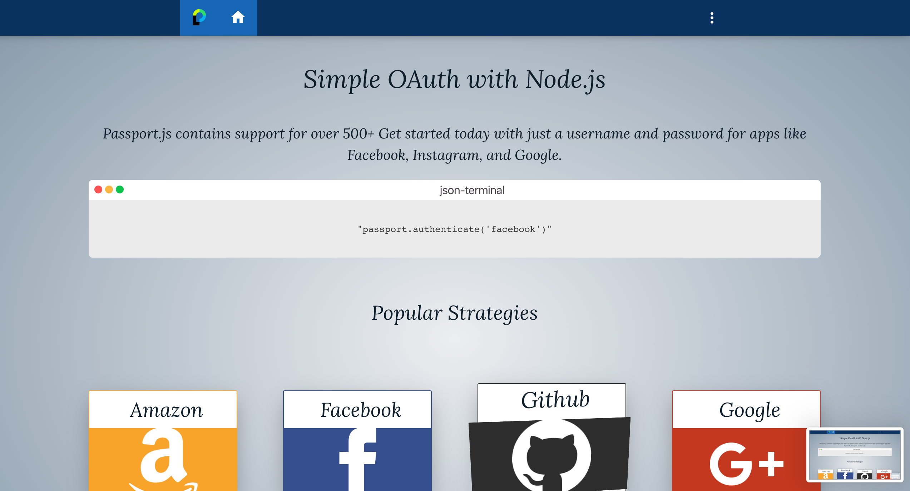

# :checkered_flag:What it should look like :checkered_flag:: 




# How It's Made :nut_and_bolt:🔨 :hammer::wrench::
 This application is written with React.js, Express, Passport.

 # How It's Works:white_check_mark::
1.) A user can log in via whatever their prefered social media they would like to use to log in.

2.) See the user JSON data once logged in 

## Lessons Learned :mortar_board::
Learned how to add OAuth2 login authentication to my app with some of your favorite socials including Facebook, Instagram, Google, Twitch, Github, and Amazon with React Hooks. This isn't my first time doin OAuth Login authentication. I have done OAuth before but with EJS, which stands for Embedded JavaScript templating, lets you generate HTML markup with plain JavaScript. That's when I first started building backends with Express, Morgan, Mongoose, Body-parser, Cookie-parser and Passport.  Check out this old app I created almost two years ago!
Ejs Example:

```  <ul class="orders">
  <% for(var i=0; i<orders.length; i++) {%>
    <li class="order">
      <span><%= orders[i].name %></span>
      <span><%= orders[i].order %></span>
      <span><%= orders[i].size %></span>
      <span><%= orders[i].cream %></span>
      <span><%= orders[i].milk %></span>
      <span><%= orders[i].sugar %></span>
      <span><i class="fa fa-trash" aria-hidden="true"></i></span>
      <span><i class="fa fa-thumbs-up" aria-hidden="true"></i></span>
    </li>
  <% } %>
  </ul>
```


https://github.com/JOHNFLEURIMOND/cafe-signin

This time around, I used React Hooks for my web app, Passport.js for the login authentication, and Node.js for our api server. I learned how to effeciently set up a proxy for the backend. There wasn't that much that changed just less code thats for sure but this wasn't hard to get going!

New Syntax for Passport :dvd:

```// Facebook Strategy
passport.use(new FacebookStrategy({
        clientID: keys.FACEBOOK.clientID,
        clientSecret: keys.FACEBOOK.clientSecret,
        callbackURL: "/auth/facebook/callback"
    },
    (accessToken, refreshToken, profile, cb) => {
        console.log(chalk.blue(JSON.stringify(profile)));
        user = { ...profile };
        return cb(null, profile);
    }));
``` 

VS Old Syntax For Passport :floppy_disk:

```   // by default, local strategy uses username and password, we will override with email
passport.use('local-login', new LocalStrategy({
        usernameField : 'email',
        passwordField : 'password',
        passReqToCallback : true // allows us to pass back the entire request to the callback
    },
    function(req, email, password, done) { // callback with email and password from our form

        // find a user whose email is the same as the forms email
        // we are checking to see if the user trying to login already exists
        User.findOne({ 'local.email' :  email }, function(err, user) {
            // if there are any errors, return the error before anything else
            if (err)
                return done(err);

            // if no user is found, return the message
            if (!user)
                return done(null, false, req.flash('loginMessage', 'No user found.')); // req.flash is the way to set flashdata using connect-flash

            // if the user is found but the password is wrong
            if (!user.validPassword(password))
                return done(null, false, req.flash('loginMessage', 'Oops! Wrong password.')); // create the loginMessage and save it to session as flashdata

            // all is well, return successful user
            return done(null, user);
        });

    }));
```
## portfolio:

** :computer:   WEBSITE:** [John Fleurimond](http://johnfleurimond.com)

# How To Get It Started :arrow_forward: :

## Installation

1. Clone repo
2. run `npm install`

## Available Scripts

In the project directory, you can run:

### `npm run dev`

Runs the app in the development mode.<br>
Open [http://localhost:3000](http://localhost:3000) to view it in the browser.

The page will reload if you make edits.<br>
You will also see any lint errors in the console.

### `npm test`

Launches the test runner in the interactive watch mode.<br>
See the section about [running tests](#running-tests) for more information.

### `npm run build`

Builds the app for production to the `build` folder.<br>
It correctly bundles React in production mode and optimizes the build for the best performance.

The build is minified and the filenames include the hashes.<br>
Your app is ready to be deployed!

See the section about [deployment](#deployment) for more information.
### `npm run prettier`
This corrects the format.

### `npm run eject`

**Note: this is a one-way operation. Once you `eject`, you can’t go back!**

If you aren’t satisfied with the build tool and configuration choices, you can `eject` at any time. This command will remove the single build dependency from your project.

Instead, it will copy all the configuration files and the transitive dependencies (Webpack, Babel, ESLint, etc) right into your project so you have full control over them. All of the commands except `eject` will still work, but they will point to the copied scripts so you can tweak them. At this point you’re on your own.

You don’t have to ever use `eject`. The curated feature set is suitable for small and middle deployments, and you shouldn’t feel obligated to use this feature. However we understand that this tool wouldn’t be useful if you couldn’t customize it when you are ready for it.

